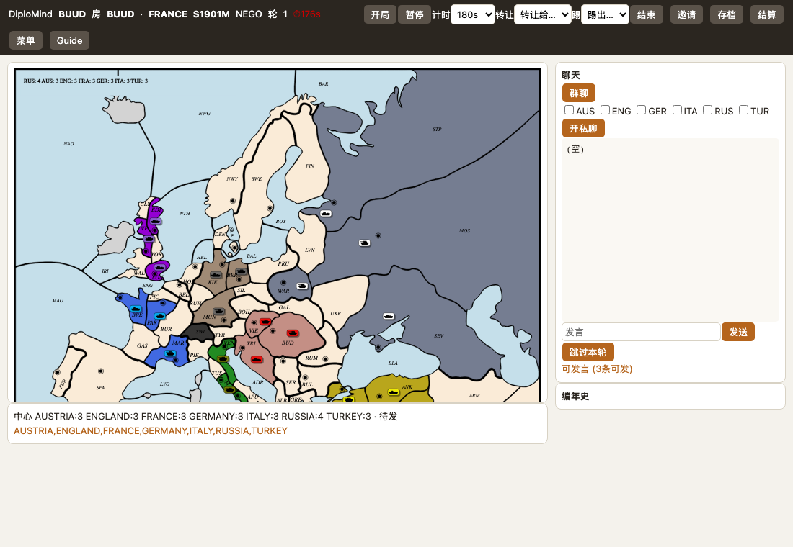
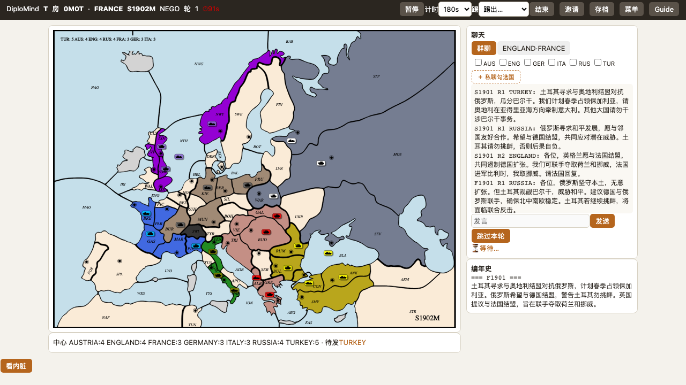

# DiploMind

[](https://github.com/jansona/DiploMind/actions/workflows/ci.yml)

[中文](README.zh-CN.md)

An LLM-powered digital version of the board game *Diplomacy*, where AI nations
negotiate, form alliances, lie, and betray in natural language. Play one great
power against AI opponents — or fill seats with friends — each AI with a hidden
persona that pursues its own win, remembers who kept promises and who stabbed it,
and turns on you when the board says so.



## Quick start
```bash
uv sync                                             # deps (Python 3.11)
uv run uvicorn diplomind.web:app --port 8731        # open http://localhost:8731
uv run pytest                                       # 77 tests
```
Default AI backend is any OpenAI-compatible API (`conf/deepseek.json`); for fully
local play run ollama and `DIPLOMIND_CONFIG=conf/ollama_qwen35_2b.json`.
`DIPLOMIND_DEBUG=1` reveals the god view (trust/intent/memory/private DMs).

## Play modes
- **Solo vs AI** — take one power, AI fills the other six.
- **All-AI spectator** — watch seven AI scheme to an 18-center solo win or a top-count finish.
- **Multiplayer (2–7 humans)** — one host creates a room, others join by code; AI fills empty seats.



## Multiplayer
- **Rooms**: host creates, shares a 4-char code / invite link; optional passcode. One server, many games.
- **Seats**: claim a country with a nickname; a seat-token resumes you on refresh. Two browser tabs = two players.
- **Owner controls**: start, pause, kick (kicked seat → AI), per-round timer (90/180/300/off), end.
- **Live sync** via SSE; works over LAN or a quick tunnel (e.g. `cloudflared tunnel --url http://localhost:8731`).

## How it works
- **Synchronous rounds**: each power sends up to 3 messages/round (group or private),
  delivered together; a silent round or the round cap ends negotiation, then everyone
  orders. Humans and AIs share one flow — only input differs (UI vs LLM); orders settle in parallel.
- **Hidden personas** drive 7 play styles; betraying an ally tanks trust and is remembered. Difficulty = each power's model tier.
- **End**: 18 centers = solo win; at the year cap the most-centers leader wins (toggle: classic survivor-draw). Final report shows winner + a center-count chart.

## Tech stack
Python backend reusing the `diplomacy` engine; FastAPI rooms (seat-tokens, SSE, timer)
+ single-file `ui.html`; structured-output JSON with lenient parsing + concurrency cap.

## License
AGPLv3 — based on the open-source [`diplomacy`](https://github.com/diplomacy/diplomacy)
engine (AGPLv3). Full text in [LICENSE](LICENSE). Dev notes in [docs/](docs/).
