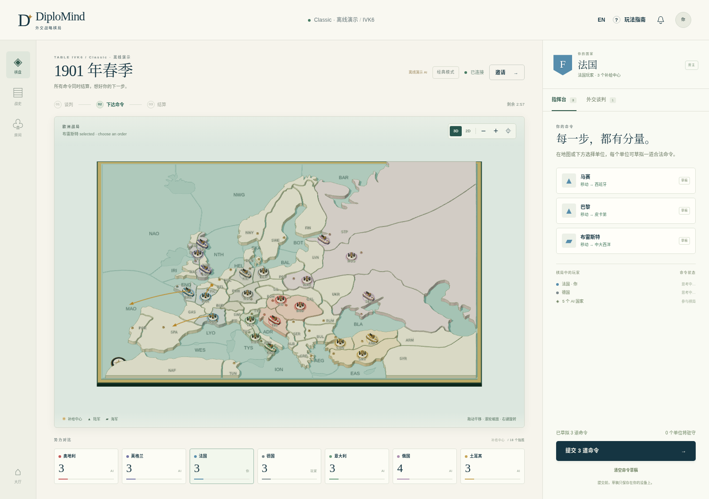
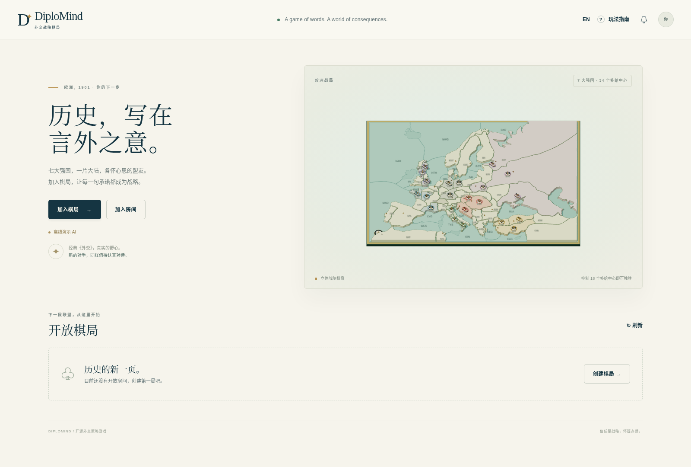
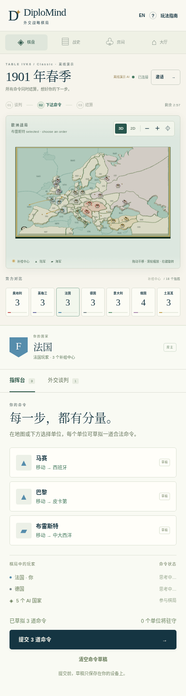

# DiploMind

A multiplayer **Classic Diplomacy** table: two to seven human players can share a room,
with AI filling the other powers. Negotiate publicly or privately, draft simultaneous
orders on a 3D map, then let the `diplomacy` rules engine adjudicate.

[中文](README.zh-CN.md) · [Provider setup](docs/PROVIDERS.md) · [Blender assets](docs/ASSETS.md)



*Actual Chromium capture of the current UI with two isolated human seats and five
offline mock opponents. It demonstrates the interface, not LLM playing strength.*

<details>
<summary>Lobby and mobile layout</summary>





</details>

## Run locally, without model costs

Requires Python 3.11+ and [uv](https://docs.astral.sh/uv/). This rebuild is on
`dot/cloud-rebuild`; the default branch has not been overwritten.

```bash
git clone --branch dot/cloud-rebuild https://github.com/jansona/DiploMind.git
cd DiploMind
uv sync --frozen
DIPLOMIND_CONFIG=conf/mock.json uv run uvicorn diplomind.web:app --host 127.0.0.1 --port 8731
# Open http://127.0.0.1:8731
```

The default provider is an **offline deterministic heuristic**, not a language model.
It is useful for trying the interface and testing game plumbing. A real LLM needs
separately configured server-side credentials or an explicitly enabled CLI adapter.
No model is called merely by opening the app.

1. Create a table and choose your power
2. Invite other players with the room code before starting
3. Each player joins in their own browser/tab and claims one available country
4. The host starts; AI fills every unclaimed power
5. Stage up to three diplomatic messages each round. The third message automatically marks you ready; choose **Ready** earlier to finish with fewer messages. Everyone’s messages are delivered together when the round closes
6. Select units and legal orders; edit freely, submit, or withdraw before resolution
7. Everyone's orders resolve together; retreats and winter adjustments use the same desk

## What's implemented

- Standard seven-power board, engine-legal moves/support/convoys/retreats/builds, 18-center solo victory
- Genuine Blender-made GLB pieces, interactive 3D board, selectable 2D fallback, order-path previews
- Independent room/seat identities, private channels, observers restricted to public information
- Turn guards and retry IDs, once-only start, explicit readiness, pause/resume, reconnect and local drafts
- Private room checkpoints preserve staged dialogue, sealed orders, AI memory/personality and seat identities
- Offline opponent and OpenAI-compatible/Ollama transports; experimental opt-in Codex, Claude Code, Qoder adapters
- Stable private personality traits, evidence-scoped trust, visible negotiation and commitments carried into decisions
- Bounded context selection and optional one-pass tactical review; `order_preflight_review` is server-only and **off by default**

AI memory and personality belong to Classic. They never create binding treaties or
public omniscient trust scores. **Plus is deferred.** Its reserved internal mode value
is not a completed alternate ruleset.

## Provider and security boundaries

See [docs/PROVIDERS.md](docs/PROVIDERS.md) before enabling any real provider. Keys stay
in the server environment. Browser clients cannot select shell commands, executable
paths, or model credentials. CLI adapter contracts are tested with mock subprocesses;
authenticated Codex/Claude Code/Qoder runs remain unverified. These adapters run
on the server; they are not an unrestricted bridge into a player’s computer.

The OpenAI-compatible transport has been exercised against Aliyun/DeepSeek in
bounded real-model tests, including two mixed-seat 1901 games and targeted tactical
probes. Illegal orders, coordination mistakes and inaccurate diplomatic claims
remain known limits. Ollama and other compatible services require their own setup.
For persistent API use, keep credentials in the server environment or a protected
file outside the checkout, and select an ignored operator config with
`DIPLOMIND_CONFIG`. Never put a key in tracked examples or browser storage.

The room token is a bearer credential. Keep the browser session or save its credentials
securely; a nickname or country name cannot recover a lost seat. Don't share tokens in
invitations. Room codes invite new members; they do not confer host permissions.

Run **one Uvicorn worker**. Room mutation is serialized on one event loop; the current
implementation is a durable single-process server, not a horizontally scaled service.
For an Internet deployment, add HTTPS, rate limits, an account/recovery design,
operational backups and a shared state/locking layer before scaling. Do not expose
developer debug mode on a public server. No public deployment is required for local play.

`DIPLOMIND_DATA_DIR` selects the data directory (default `logs`). Room checkpoints use
private atomic files; after a server restart, a returning token recovers the game paused.
The host resumes after reviewing it. Global anonymous save import is intentionally
unavailable. Unanimous draw voting is not yet implemented. Optional configured year
limits end in a survivor draw after the complete named year; there is no default cap.

## Verification

```bash
uv run pytest -q
node --test tests/test_frontend*.mjs
# Real browser acceptance, against an already running mock-config server:
uv run python scripts/e2e_mixed.py
```

The browser acceptance script uses isolated contexts for two scripted human clients
and an observer, five heuristic AI opponents, and checks private chat, draft editing,
refresh/offline recovery, readiness, withdrawal, checkpoint restoration, adjudication
and mobile layout. Screenshots and a machine-readable report are written under
`artifacts/e2e/`. Install Playwright Chromium or set `CHROMIUM_EXECUTABLE` to an existing
Chromium binary. In sandboxed environments the browser may require the authorized
cloud desktop's normal application runtime.

The recovered implementation passed **539 Python tests and 21 frontend tests**;
the nine-check browser acceptance covers the mixed-client flow. The opt-in native
readiness gesture test was also run separately. Current screenshots use a fresh
mock room with no private human conversation or real credentials.

These tests validate functionality and privacy. They do not establish the strategic
strength or entertainment value of real language-model opponents.

Current iteration results: [real mixed-game replay](docs/REAL_REPLAY_REVIEW.zh-CN.md),
[context selection A/B](docs/CONTEXT_AB_REVIEW.zh-CN.md),
[order consistency and thinking latency](docs/ORDER_CONSISTENCY_REVIEW.zh-CN.md),
[optional one-pass tactical review](docs/TACTICAL_REVIEW.zh-CN.md),
and [frontend/server performance](docs/PERFORMANCE.md). These reports include
remaining model mistakes and distinguish synthetic probes from actual gameplay.

## Source and license

Python 3.11+, FastAPI, `diplomacy`; framework-free ES modules and locally vendored Three.js.
Editable Blender sources and reproducible export scripts live in `assets/blender/`.

AGPLv3. The Diplomacy engine and supplied map retain their upstream notices; Three.js
is MIT. See [LICENSE](LICENSE), [asset documentation](docs/ASSETS.md) and the vendored
license file. No code was copied from AI_Diplomacy.
